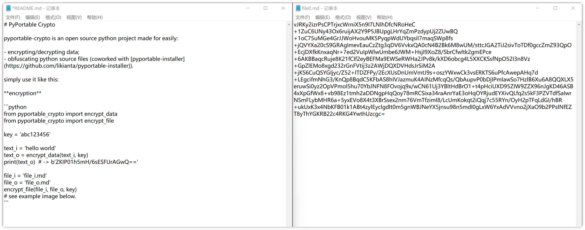

# PyPortable Crypto

[中文版点此阅读](./README.zh.md)

`pyportable-crypto` is an open source python project made for easily...

- Encrypting/decrypting texts.
- Protecting python source code (co-worked with [pyportable-installer](https://github.com/likianta/pyportable-installer)).

## Installation

```sh
pip install pyportable-crypto
```

The minimum required python version is 3.8.

## Get Started

### Encryption

```python
from pyportable_crypto import encrypt_data
from pyportable_crypto import encrypt_file

key = 'abc123456'

text_i = 'hello world'
text_o = encrypt_data(text_i, key)  # type: bytes
print(text_o)  # -> b'ZKIP01h5mH/6sESFUrAGwQ=='

file_i = 'file_i.md'
file_o = 'file_o.md'
encrypt_file(file_i, file_o, key)  # returns file_o
# see example image below.
```



### Decryption

```python
from pyportable_crypto import decrypt_data
from pyportable_crypto import decrypt_file

key = 'abc123456'

text_i = b'ZKIP01h5mH/6sESFUrAGwQ=='  # type: bytes
text_o = decrypt_data(text_i, key)  # type: str
print(text_o)  # -> 'hello world'

file_i = 'file_i.md'
file_o = 'file_o.md'
decrypt_file(file_i, file_o, key)  # returns file_o
```

### Protect Python Source Code

This is pyportable-crypto's highlighted feature. You can use its methods both in script and in cmd to compile your python files to be obfuscated. Then share it to client side, the users can run it but cannot read it, cause every file is encrypted by this library and the key is hidden in its runtime package which is also UNEXTRACTABLE (see related research in this [article (*TODO*)](TODO)).

**Compile in script**

```python
from pyportable_crypto import Compiler
from uuid import uuid1
compiler = Compiler(key=str(uuid1()), dir_o='~/my_project/lib')
#   `[param]dir_o` is the dir to generate a custom runtime package in it.
#   it means a package `{dir_o}/pypurtable_runtiem` will be created.
#   the `[param]key` is stored in pypurtable_runtiem and will be used for 
#   loading py-encrypted files in user's computer.

# compile single file
compiler.compile_file(
    file_i='~/my_project/src/main.py', 
    file_o='~/my_project/dist/main.py'
    #   use the same name and the same extension name.
)

# compile directory (by recursively)
compiler.compile_dir(
    dir_i='~/my_project/src',
    dir_o='~/my_project/dist',
    # file_exists_scheme='skip'
)
#   it is suggested to use an empty folder to store the compiled files.
#   compiler compiles source files to dist with the same file name and 
#   the same file extension name.

```

**Compile in CMD**

```sh
python -m pyportable_crypto compile-file <file_i> <file_o> <key>
#   the bundled `pyportable_runtime` package will also be generated in 
#   the same directory of <file_o>.

python -m pyportable_crypto compile-dir <dir_i> <dir_o> <key>
#   the bundled `pyportable_runtime` package will also be generated in 
#   the same directory with <dir_o>.
```

The compiled files are looked like this:

```python
# some_compiled_files.py
from pyportable_runtime import decrypt
globals(decrypt(b'ZKIP01h5mH/6sESFUrAGwQ==...', globals(), locals()))
```

The function `decrypt` converts encrypted text to python object (a dict type), users can access this object but cannot get the real source code from it.

PS: Don't forget to package `~/my_project/lib/pyportable_runtime` to distribution and add it to `sys.path` before importing other modules.

