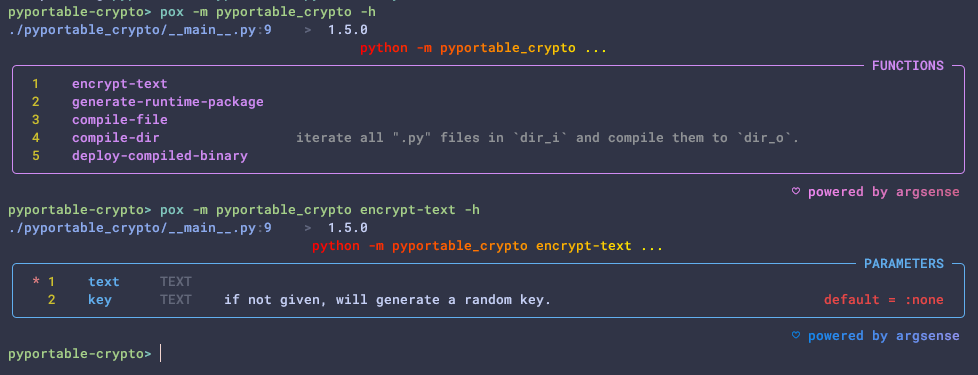
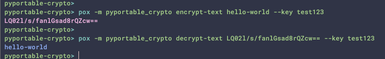
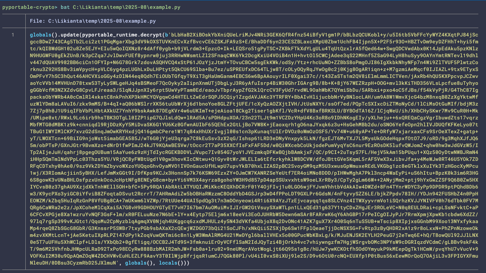

# PyPortable Crypto

- [中文版](./README.zh.md) (内容已过时, 待更新)

An experimental encryption tool for encrypting Python code.

Warning: This project is under proof-in-concept stage, no guarantee for 
production use.

## Installation

```shell
pip install pyportable-crypto
```

## Usage

Both can be used in command line and Python script.

### Get help

For command line usage, check the help info below:

```shell
# list all commands
python -m pyportable_crypto -h

# get help for specific command
python -m pyportable_crypto <command> -h
```



For Python script usage, check the docstrings of the public functions in `pyportable_crypto/__init__.py`.

### Encrypt/decrypt a snippet of text

In command line:

```shell
python -m pyportable_crypto encrypt-text <text> <key>
python -m pyportable_crypto decrypt-text <encrypted_text> <key>
```



In Python script:

```python
from pyportable_crypto import encrypt_data
encrypt_data('hello-world', key='test123')
# -> b'LQ02l/s/fanlGsad8rQZcw=='
encrypt_data(b'hello-world', key='test123')
# -> b'LQ02l/s/fanlGsad8rQZcw=='

from pyportable_crypto import decrypt_data
decrypt_data(b'LQ02l/s/fanlGsad8rQZcw==', key='test123')
# -> b'hello-world'
```

### Compile Python modules/packages

It is slightly different with `encrypt_data`, that we add a bit of wrapper code 
to make the module still works feeling like it is a normal module.

```python
from pyportable_crypto import compile_file
compile_file('hello_world.py', 'hello_world_enc.py', key='test123')

from pyportable_crypto import compile_dir
compile_dir(
    'example_package', 
    'example_package_enc', 
    key='test123', 
    add_runtime_package='outside'  # 'inside' | 'outside' | 'no'
)
```

-   For the first time compilation, it will take one minute or so. 
    
    The subsequent calls with the same key will be much faster since it is cached.

-   The compiled file is also ".py" file, you can open it with any text editor.
    The content would be like this:
    
    

-   There will create a side package `pyportable_runtime` besides 
    "hello_world_enc.py", or, for `compile_dir` it is created depending on the 
    value of `[param]add_runtime_package`.
    
    For example `add_runtime_package='inside'` is:

    ```
    |= example_package
        |- __init__.py
        |- foo.py
        |- bar.py
    |= example_package_enc
        |- __init__.py
        |- foo.py  # encrypted
        |- bar.py  # encrypted
        |= pyportable_runtime  # inside
            |- __init__.py
            |- cipher.pyd
    ```
    
    For `add_runtime_package='outside'` is:    

    ```
    |= example_package
        |- __init__.py
        |- foo.py
        |- bar.py
    |= example_package_enc
        |- __init__.py
        |- foo.py  # encrypted
        |- bar.py  # encrypted
    |= pyportable_runtime  # outside
        |- __init__.py
        |- cipher.pyd
    ```

-   You can import the result and use it like a normal module.

    ```python
    from hello_world import echo
    echo('hello world')
    # -> 'hello world'
    
    # note: add the following line at the top of your script.
    import pyportable_runtime  # noqa
    pyportable_runtime.setup()  # just do it once. will be globally effected.
    
    from hello_world_enc import echo
    echo('hello world')
    # -> 'hello world'
    ```
